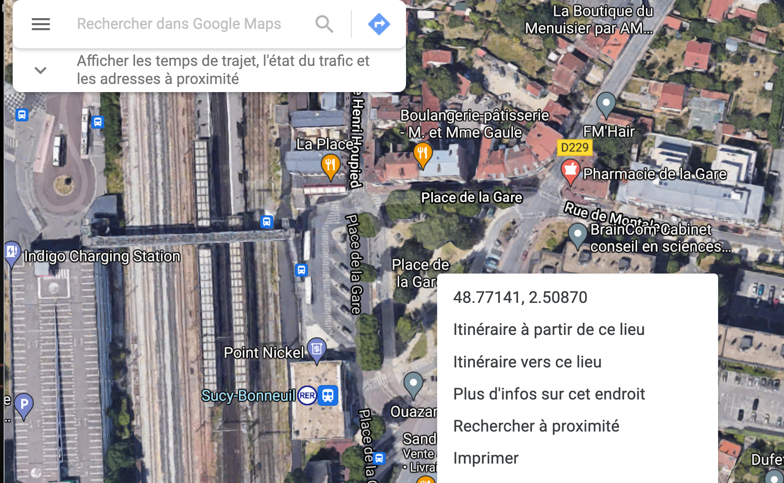

```{r  echo=TRUE, cache=FALSE, warning=FALSE}
library(knitr)
## Global options
options(max.print="80")
opts_chunk$set(echo=TRUE,
               cache=FALSE,
               prompt=FALSE,
               tidy=FALSE,
               comment=NA,
               message=FALSE,
               warning=FALSE,
               options(scipen=999))
opts_knit$set(width=75)

# Packages utilitaires
library(dplyr)
library(rmdformats)

# Packages graphiques
library(ggplot2)
library(RColorBrewer)

#packages cartographiques 
library(sf)
library(leaflet)
library(htmlwidgets)
library(htmltools)

# Appel d'API
library(httr)
library(jsonlite)
library(geojsonsf)

```


## Premiers pas


Ce cours propose de fournir les bases élémentaires du logiciel Leaflet. 

::: {.callout-tip}
## Sources
Ce cours est très largement inspiré d'un article d'Elena Salette publié sur l'excellent site de formation ThinkR et intitulé [Cartographie interactive : comment visualiser mes données spatiales de manière dynamique avec leaflet ?](https://thinkr.fr/cartographie-interactive-comment-visualiser-mes-donnees-spatiales-de-maniere-dynamique-avec-leaflet/) 
:::


Notre premier objectif très limité sera de construire une carte interactive utilisant le fonds de carte OpenStreetMap que l'on pourra zoomer en avant ou en arrière. La carte comportera la localisation de la place de la gare à Sucy-en-Brie avec une "épingle" de localisation comportant une photographie de la gare et un petit texte de promotion de celle-ci. 

### Lancement avec `leaflet()`

Nous allons avoir besoin des packages suivants :

- `leaflet` puisque c'est l'objet même du cours !
- `dplyr` afin de pouvoir construire des programmes utilisant des pipes `%>%`
- `sf` pour charger des fonds de carte de différents types (points, lignes polygones)
- `htmltools` et `htmlwidgets` pour ajouter des popups interactifs sur notre carte

Pour vérifier que le package leaflet est bien installé, nous créons une première carte (vide !)

```{r}
map <- leaflet()

map
```

Et il n'y a ... RIEN ! si ce n'est un bouton de zoom


### Remplissage avec `addTiles()`

On ajoute sur ce fond de carte vide des "tuiles" cartographiques qui sont des images se modifiant selon l'échelle pour apporter plus ou moins de détails. Par défaut, le fonds de carte de référence est le fonds `OpenStreetMap`

```{r}
library(leaflet)

map <- leaflet() %>%
          addTiles()

map
```
La carte est désormais interactive et on peut effectuer des zooms ou se déplacer.


### Calage avec `setView()`

Nous allons ensuite choisir un point de référence, par exemple la place de la gare à Sucy-en-Brie. Pour trouver les coordonnées de latitude et longitude, la solution la plus simple est d'utiliser [Google Maps](https://www.google.fr/maps) puis de zoomer sur la zone d'étude et enfin d'**effectuer un click droit avec la souris sur le point dont on cherche les coordonnées** pour obtenir dans un popup les coordonnées recherchées : 


On peut alors procéder à une double opération de **centrage** de notre carte et de définition d'une **échelle d'observation** afin que la carte produite par `leaflet`couvre bien la zone qui nous intéresse. Cette double opération est réalisée à l'aide de la fonction `setView()` assortie des trois paramètre suivants :

- `lng =` pour la longitude
- `lat =` pour la latitude
- `zoom =` pour le degré d'aggrandissement de la carte de 1 pour le Monde entier à 20 pour une vision ulra locale


```{r}
map <- leaflet() %>% 
          addTiles() %>%
          setView(lat = 48.77141, lng=2.50870, zoom = 17)

map
```

Une fois qu'on a vérifié le centrage avec un zoom fort (ici 17), on peut refaire la carte en utilisant un zoom plus faible, par exemple un zoom de 12 permettant de visualiser toute la commune de Sucy et les communes voisines.

```{r}
map <- leaflet() %>% 
          addTiles() %>%
          setView(lat = 48.77141, lng=2.50870, zoom = 12)

map
```

### Personalisation avec  `addProviderTiles()`

Les tuiles OpenStreetMap qui servent de fonds de carte par défaut peuvent être remplacés par des tuiles personalisées fournies par des producteurs publics ou privés. On peut obtenir la liste des tuiles disponibles en tapant `providers` dans la console de R studio et les tester une par une. Mais il est souvent plus simple et plus rapide d'aller visualiser les tuiles disponibles sur [ce site web](http://leaflet-extras.github.io/leaflet-providers/preview/) où l'on peut centrer le monde sur sa zone d'étude et voir ce que donnent les différentes familles de tuiles. 

A titre d'exemple, les tuiles `OpenTopoMap` permettent de voir la carte topographique de type IGN en couleur :


```{r}
map <- leaflet() %>% 
            addProviderTiles('OpenTopoMap') %>%
          setView(lat = 48.77141, lng=2.50870, zoom = 12)

map

```

La couche `Esri.WorldTopoMap` fournit également une imagerie précise mais de couleurs plus neutre que les tuiles `OpenTopoMap` ou OpenStreetMap , ce qui sera intéressant si on superspose des marqueurs de couleur vive. 


```{r}
map <- leaflet() %>% 
            addProviderTiles('Esri.WorldTopoMap') %>%
          setView(lat = 48.77141, lng=2.50870, zoom = 12)
map

```


### Affichage d'un point avec `addMarkers()`

L'usage le plus fréquent de `leaflet`consiste à ajouter des éléments de localisation ponctuelle appelés `markers`et de rendre ces objets ponctuels interactifs avec l'ouverture de fenêtres `popups`lorsqu'on clique dessus avec la souris. On va donc voir pas à pas comment construire de telles cartes interactives en partant du cas le plus simple (marqueur unique) pour aller vers les cas plus complexes (ensemble de marqueurs de taille, couleur et formes différentes).

Nous allons commencer par indiquer l'emplacement de la place de la gare de Sucy-en-Brie sur notre carte précédente à l'aide de la fonction `addMarkers()` : 

```{r}
map <- leaflet() %>% 
            addProviderTiles('Esri.WorldTopoMap') %>%
            setView(lat = 48.77141, lng=2.50870, zoom = 12) %>% 
            addMarkers(lat = 48.77141, lng=2.50870)
map
```
On constate que le marqueur donne bien la position choisi mais n'est pas interactif. Il faut ajouter plus de paramètres pour assurer l'interactivité. 

### Ajout d'un `label`ou d'un `popup`

On peut définir deux comportements d'un marker selon que la souris ne fait que passer dessus (`label`) ou selon que l'utilisateur effectue un click sur marker et déclenche l'ouverture d'une fenêtre (`popup`). Dans sa version la plus simple, l'interactivité consiste à ajouter une chaîne de caractère à ces deux paramètres. 

```{r}
icone_gare <-makeIcon(iconUrl = "img/gare.png")
map <- leaflet() %>% 
            addProviderTiles('Esri.WorldTopoMap') %>%
            setView(lat = 48.77141, lng=2.50870, zoom = 12) %>% 
            addMarkers(lat = 48.77141, lng=2.50870,
                      # En passant la souris
                      label = "GARE DE SUCY-BONNEUIL", 
                      # En cliquant sur l'icone
                       popup = "La gare RER A de Sucy Bonneuil est bien reliée aux communes 
                                 environnantes par un réseau de bus partant dans toutes les directions")
map
```


### Amélioration du `popup`

Mais on peut faire beaucoup mieux, notamment pour la fenêtre `popup`qui peut prendre la forme d'une mini-page web dont on fixe le contenu en html avec la fonction `paste0()` et les dimensions avec le sous-paramètre `popupOptions()`. 


```{r}


# Préparation de la fenêtre Popup
    my_popup = paste0(
      "<b> LA GARE DE SUCY",
      "</b><br/><br/>",
      "La gare RER A de Sucy Bonneuil est bien reliée aux communes environnantes par un réseau de bus partant dans toutes les directions.")


  
# Réalisation de la carte
map <- leaflet() %>% 
            addProviderTiles('Esri.WorldTopoMap') %>%
            setView(lat = 48.77141, lng=2.50870, zoom = 12) %>% 
            addMarkers(lat = 48.77141, lng=2.50870,
                      # En passant la souris
                      label = "GARE DE SUCY-BONNEUIL", 
                      # En cliquant sur l'icone
                       popup = my_popup, 
                      # Quelques options de la popup
                        popupOptions = 
                      list(maxHeight = 350, maxWidth = 200))
map

```


### Prolongements

Et voila, le tour est joué. Il faut maintenant réfléchir à la façon de construire une carte comportant un ensemble d'épingles similaires avec des couleurs ou des formes différentes, des messages différents, des photographies variées ... Il ne sera alors évidemment pas possible d'ajouter une commande addMarkers() pour chaque épingle si la carte en comporte des centaines. 

Si vous avez bien compris ce cours, vous pourrez trouver des réponses en lisant de façon autonome le reste de l'article dont nous nous somme inspiré : [Cartographie interactive : comment visualiser mes données spatiales de manière dynamique avec leaflet ?](https://thinkr.fr/cartographie-interactive-comment-visualiser-mes-donnees-spatiales-de-maniere-dynamique-avec-leaflet/) 


## B. Importation de données DVF

Nous allons réviser ici une certain nombre de notions vus dans les cours précédents sur l'utilisation des API et la cartographie statique. On suppose que l'on veut étudier **la distribution des ventes immobilières à Sucy-en-Brie par quartier IRIS*.**

### Récupération des données DVF par API

 On choisit  d'utiliser la base des **demandes de valeurs foncières géolmcalisées** accessible par API via le site public.opendatasoft.com. La requête ci-dessous permet de demander l'ensemble des **ventes** intervenues dans la commune de **Sucy-en-Brie** en **2023**.  

```{r}
myurl <- "https://public.opendatasoft.com/api/explore/v2.1/catalog/datasets/buildingref-france-demande-de-valeurs-foncieres-geolocalisee-millesime/exports/geojson/?lang=fr&refine=date_mutation%3A2023&refine=nature_mutation%3AVente&where=%28search%28%22sucy-en-brie%22%29%29"

mymap<-st_read(myurl) 
dim(mymap)
class(mymap)
```

Le tableau comporte 687 ventes décrites par 46 variables. 


### Sélection des ventes uniques de maisons et appartements

On décide de ne conserver que les **ventes simples** de **maison** ou d'**appartement**. On utilise pour cela un programme qui sera rediscuté par la suite dans le cours de C. Signoretto.

```{r}
## Sélectionne les biens de type maisons ou appartements
mymap <- mymap %>% filter(type_local %in% c("Maison", "Appartement"))

## Calcule  le nombre de biens vendus par mutation
nbv <- mymap %>% st_drop_geometry() %>%
         group_by(id_mutation) %>% count()

## Effectue une jointure et exclue les ventes multiples
mymap <- mymap %>% left_join(nbv) %>% filter(n==1)

```

Il ne reste que 244 biens correspondant à des ventes uniques de maisons ou d'appartement.

### Sélection des variables intéressantes

On décide de ne retenir qu'un petit nombre de variables et de les recoder pour un usage plus facile. On ajoute la variable prix au m2.

```{r}
mymap <- mymap %>% mutate(  adresse = paste(adresse_numero, 
                                          adresse_nom_voie, 
                                          code_postal, 
                                          com_name)) %>%
              select(id = id_mutation,
                           adresse,
                          code = com_code,
                          date = date_mutation,
                          type = type_local,
                          prix = valeur_fonciere,
                          sup = surface_reelle_bati,
                          nbp = nombre_pieces_principales,
                          ter = surface_terrain,
                          lat = latitude,
                          lon = longitude,
                          )

```


### Création d'une fonction simple


On reprend l'ensemble de nos étapes pour créer une fonction qui extrait automatiquement les données d'une commune à une date donnée.

```{r}
dvfcomyear <- function(mycom = "sucy-en-brie",
                        myyear = "2023") {
 myurl <- paste0("https://public.opendatasoft.com/api/explore/v2.1/catalog/datasets/buildingref-france-demande-de-valeurs-foncieres-geolocalisee-millesime/exports/geojson/?lang=fr&refine=date_mutation%3A",myyear,"&refine=nature_mutation%3AVente&where=%28search%28%22",mycom,"%22%29%29")
 
 mymap<-st_read(myurl,quiet = T) 
 
 ## Sélectionne les biens de type maisons ou appartements
mymap <- mymap %>% filter(type_local %in% c("Maison", "Appartement"))

## Calcule  le nombre de biens vendus par mutation
nbv <- mymap %>% st_drop_geometry() %>%
         group_by(id_mutation) %>% count()

## Effectue une jointure et exclue les ventes multiples
mymap <- mymap %>% left_join(nbv) %>% filter(n==1)
 
mymap <- mymap %>% mutate(  adresse = paste(adresse_numero, 
                                          adresse_nom_voie, 
                                          code_postal, 
                                          com_name)) %>%
              select(id = id_mutation,
                           adresse,
                          code = com_code,
                          date = date_mutation,
                          type = type_local,
                          prix = valeur_fonciere,
                          sup = surface_reelle_bati,
                          nbp = nombre_pieces_principales,
                          ter = surface_terrain,
                          lat = latitude,
                          lon = longitude,
                          ) %>% 
           mutate(type = as.factor(type),
                  prixm2 = prix/sup)
  
}
```


On teste la fonction par défaut :

```{r}
x<- dvfcomyear()
head(x)
```

On peut changer la date : 

```{r}
x<-dvfcomyear(,myyear="2014")
head(x)
```


On peut appliquer à une autre commune (nom en minuscule) et une autre date

```{r}
x<-dvfcomyear(mycom = "vitry-sur-seine",myyear="2020")
head(x)
```


## C. Cartographie statique

Prenons l'exemples des ventes à Suyc-en-Brie en 2014 et essayons de visualiser les ventes avec différents packages :

```{r}
mapDVF <- dvfcomyear(mycom = "sucy-en-brie",myyear = "2014")
```


### Nuages de points avec sf

On peut visualiser la position des ventes avec sf


```{r}
par(mar=c(0,0,0,0))
plot(mapDVF$geometry,cex=0.5, pch=20,bg = "lightyellow", col="red")
```

On peut également visualiser le type de bien (maison ou appartement)

```{r}
par(mar=c(0,0,0,0))
plot(mapDVF$geometry,
     cex=0.5, 
     pch=20,
     bg = "lightyellow", 
     col=mapDVF$type)
```

Voire ajouter la taille en prenant la racine carré du nombre de pièce

```{r}
par(mar=c(0,0,0,0))
plot(mapDVF$geometry,
     cex=sqrt(mapDVF$nbp),
     pch=20,
     bg = "lightyellow", 
     col=mapDVF$type)
```


La carte s'affiche mais on ne sait pas trop bien où l'on est ...  On  sauvegarde le résultat.

```{r}
saveRDS(mapDVF, "data/map_DVF.RDS")
```


### Ajout de données aréales

On souhaite visualiser le niveau de vie des quartiers de la commine

Tant qu'à faire, on importe un fonds de carte des IRIS donnant quelques indications sociales sur la richesse ou la pauvreté des habitants. On va utiliser pour cela une base concernant l'[indice de défavorisation sociale par IRIS](https://public.opendatasoft.com/explore/dataset/indice-de-defavorisation-sociale-fdep-par-iris/information/)en 2014, accessible sur Public.opendatasoft


```{r}
myurl<-"https://public.opendatasoft.com/api/explore/v2.1/catalog/datasets/indice-de-defavorisation-sociale-fdep-par-iris/exports/geojson?lang=fr&refine=c_nom_com%3A%22SUCY-EN-BRIE%22&timezone=Europe%2FBerlin"
mapiris<-st_read(myurl)
```


On peut facilement visualiser une carte du revenu médian par IRIS avec sf

```{r}
plot(mapiris["t1_rev_med"])
```

On sauvegarde le fonds des IRIS pour pouvoir l'utiliser ensuite.

```{r}
saveRDS(mapiris, "data/map_iris.RDS")
```


### Cartographie avec mapsf


Si vous avez bien retenu les cours précédents, il est assez simple de superposer la couche des IRIS et celle des restaurants à l'aide du logiciel mapsf. Voici une solution minimale:


```{r}
library(mapsf)
mapiris<-readRDS("data/map_iris.RDS")
mapDVF<-readRDS("data/map_dvf.RDS")

mf_map(mapiris, type="choro", var= "t1_rev_med")
mf_map(mapDVF, type="typo", var="type", pch=20, cex=2, add=T)
mf_layout("Revenu par quartier et types de vente immobilière")
```

La carte n'est toutefois pas très satisfaisante car le fonds est non projeté (EPSG = 4326) et l'échelle est absurde. Il faut utiliser la projection française (EPS=2154) pour obtenir un résultat correct. 

Voici la carte corrigée et améliorée en y ajoutant le nombre de pièces et le type des logements.

```{r}
library(mapsf)
mapiris<-readRDS("data/map_iris.RDS") %>% st_transform(2154)
mapDVF<-readRDS("data/map_DVF.RDS") %>% st_transform(2154)

mf_theme("agolalight")
mf_map(mapiris, type="choro", 
       var= "t1_rev_med",
       pal="Grays",
       leg_title = "Revenu médian 2014",
       leg_pos = "topright",
       leg_val_rnd = 0)
mf_map(mapDVF, type="prop_typo", 
       var=c("nbp","type"), 
       pal=c("lightblue","pink"),
       inches=0.06,
       leg_title = c("Nombre de pièces","Type de logement"),
       leg_pos = c("top","topleft"),
       add=T)
mf_layout(title = "Revenu et ventes de maisons ou appartements en 2014",
          credits = "Source : DVF et Indice de défavorisation sociale 2014",
          frame=T, arrow=F)
```
- **Commentaire** : La carte obtenues est intéressante mais soulève beaucoup de questions, notamment en ce qui concerne les "vides". On trouve des zones sans aucune vente de logement et parfois même des quartiers entiées n'ayant enregistré aucune vente. On devine qu'il y a une explication mais la carte proposée ne permet pas de la trouver. 


## D. Cartographie dynamique 


### Importation des données

Nous récupérons les données sur les ventes immmobilières et les quartiers de Sucy-en-Bie en 2014 qui ont été élaborées au cours de l'exercice précédent

```{r}
dvf<-readRDS("data/map_DVF.RDS")
iris <-readRDS("data/map_iris.RDS")
```

Nous vérifions que la projection est bien de type WGS 84 (code EPSG = 4326)

```{r}
st_crs(dvf)
st_crs(iris)
```

Si ce n'est pas le cas, on execute le programme suivant qui change la projection à l'aide de la fonction `st_transform()` du package **sf**

```{r}
dvf <- sf::st_transform(dvf, crs = 4326)
iris <- sf::st_transform(iris, crs = 4326)
```


### Cartographie des localisations

On commence par créer une carte des ventes avec AddCircleMarkers()


```{r}

  
# Réalisation de la carte
map <- leaflet() %>% 
            addProviderTiles('Esri.WorldTopoMap') %>%
             addCircleMarkers(data=dvf)

map
```


### Taille des cercles : variable de stock

On règle la taille des cercles en fonction du nombre de pièces des logements. On décide que la  la taille maximale sera de 6 pixels


```{r}
# Calcul du diamètre des cercles
  dvf$myradius <-6*sqrt(dvf$nbp/max(dvf$nbp,na.rm=T))
  
# Réalisation de la carte
map <- leaflet() %>% 
            addProviderTiles('Esri.WorldTopoMap') %>%
  
             addCircleMarkers(data=dvf,
                              radius= ~myradius,    # diamètre
                              stroke=FALSE,         # pas de bordure           
                              fillOpacity = 0.5)    # opacité 
            
                              

map
```


### Couleur des cercles : attribut quantitatif

On souhaite visualiser le prix au m2 des logements? On commence par analyser la distribution :

```{r}
dvf$prixm2 <- round(dvf$prixm2,0)
summary(dvf$prixm2)
hist(dvf$prixm2)
```


Dans le cas d'une variable quantitative on définit des classes à l'aide de la fonction `colorBin()`


```{r}

# Choix des classes 
    mycut<-c(0,2000, 3000, 4000, 5000,10000)
    
# Choix de la palette (c'est une fonction !)
   mypal <- colorBin('Spectral', 
                       reverse = T,
                       dvf$prixm2,
                       bins=mycut)
    

  
# Réalisation de la carte
map <- leaflet() %>% 
            addProviderTiles('Esri.WorldTopoMap') %>%
  
             addCircleMarkers(data=dvf,
                              radius= 5 ,    # diamètre fixe
                              stroke=TRUE,          # bordure   
                              weight=1  ,           # épaisseur de la bordure
                              color= "black",      # couleur de la bordure
                              opacity = 0.7  ,       # opacité de la bordure 
                              fillOpacity = 0.5,    # opacité 
                              fillColor = ~mypal(prixm2),
                              label = ~prixm2
                              )    %>%
              addLegend(data = dvf,
                      pal = mypal, 
                      title = "Prix au m2",
                      values =~prixm2, 
                      position = 'topright') 
            
                              

map
```


### Couleur des cercles : variables qualitatives

On peut aussi utiliser la couleur des cercles dans le cas d'une variable qualitative (factor).  On définit alors la couleur par la fonction `colorFactor()`. Soit par exemple le cas des maisons et appartements : 


```{r}
levels(dvf$type)

# Choix des classes 
mypal <- colorFactor(c("blue", "red"), domain = c("Maison", "Appartement"))
    

  
# Réalisation de la carte
map <- leaflet() %>% 
            addProviderTiles('Esri.WorldTopoMap') %>%
  
             addCircleMarkers(data=dvf,
                              radius= 5 ,    # diamètre fixe
                              stroke=TRUE,          # bordure   
                              weight=1  ,           # épaisseur de la bordure
                              color= "black",      # couleur de la bordure
                              opacity = 0.7  ,       # opacité de la bordure 
                              fillOpacity = 0.5,    # opacité 
                              fillColor = ~mypal(type)
                              )    %>%
              addLegend(data = dvf,
                      pal = mypal, 
                      title = "Type de logement",
                      values =~type, 
                      position = 'topright') 
            
                              

map
```


### Ajout d'un popup d'information

On peut rajouter un popup pour afficher des informations détaillées sur chaque restaurant 


```{r}
# Choix des classes 
mypal <- colorFactor(c("blue", "red"), domain = c("Maison", "Appartement"))
    

# Préparation des popups
      mypopups <- lapply(seq(nrow(dvf)), function(i) {
      paste0(  paste("n° vente         : "      ,dvf$id[i]), '<br>', 
               paste("adresse          : "      ,dvf$adresse[i]), '<br>', 
               paste("Date de mutation : ", as.character(dvf$date[i])), '<br>',
               paste("Type de logement : " ,  dvf$type[i]), '<br>',
               paste("Nombre de pièces : ", dvf$nbp[i])  , '<br>',
               paste("Surface          : " ,  dvf$sup[i]), '<br>',
               paste("Prix             : ", dvf$prix[i])  , '<br>',               
               paste("Prix /m2         : ", round(dvf$prixm2[i],0))               
               )
            
            })
      mypopups<-lapply(mypopups, htmltools::HTML)  
      
  

# Réalisation de la carte
map <- leaflet() %>% 
            addProviderTiles('Esri.WorldTopoMap') %>%
  
             addCircleMarkers(data=dvf,
                              radius= 5 ,               # diamètre fixe
                              stroke=TRUE,              # bordure   
                              weight=1  ,               # épaisseur de la bordure
                              color= "black",           # couleur de la bordure
                              opacity = 0.7  ,          # opacité de la bordure 
                              fillOpacity = 0.5,        # opacité 
                              fillColor = ~mypal(type), # couleur selon le type
                              popup = mypopups          # Mon popup
                              
                              
                              )    %>%
              addLegend(data = dvf,
                      pal = mypal, 
                      title = "Type de bien",
                      values =~type, 
                      position = 'topright') 
            
                              

map
   
```

### Choix des tuiles

On fait varier les tuiles pour offrir la possibilité de visualiser la position des maisons sur un plan ou sur une photo aérienne.

```{r}

# Choix des classes 
mypal <- colorFactor(c("blue", "red"), domain = c("Maison", "Appartement"))
    

# Préparation des popups
      mypopups <- lapply(seq(nrow(dvf)), function(i) {
      paste0(  paste("n° vente         : "      ,dvf$id[i]), '<br>', 
               paste("adresse          : "      ,dvf$adresse[i]), '<br>', 
               paste("Date de mutation : ", as.character(dvf$date[i])), '<br>',
               paste("Type de logement : " ,  dvf$type[i]), '<br>',
               paste("Nombre de pièces : ", dvf$nbp[i])  , '<br>',
               paste("Surface          : " ,  dvf$sup[i]), '<br>',
               paste("Prix             : ", dvf$prix[i])  , '<br>',               
               paste("Prix /m2         : ", round(dvf$prixm2[i],0))               
               )
            
            })
      mypopups<-lapply(mypopups, htmltools::HTML)  
      
  

# Réalisation de la carte
map <- leaflet() %>% 
               # Tuiles
               addTiles(group = "OSM ") %>%
               addProviderTiles('Esri.WorldTopoMap', group = "ESRI topo.") %>%
               addProviderTiles('Esri.WorldImagery', group = "ESRI photo.") %>%
  
              # Contrôle des tuiles
               addLayersControl( baseGroups = c("OSM","ESRI topo.","ESRI photo."),
                                 position = "bottomright") %>%
  
             addCircleMarkers(data=dvf,
                              radius= 5 ,               # diamètre fixe
                              stroke=TRUE,              # bordure   
                              weight=1  ,               # épaisseur de la bordure
                              color= "black",           # couleur de la bordure
                              opacity = 0.7  ,          # opacité de la bordure 
                              fillOpacity = 0.5,        # opacité 
                              fillColor = ~mypal(type), # couleur selon le type
                              popup = mypopups          # Mon popup
                              
                              
                              )    %>%
              addLegend(data = dvf,
                      pal = mypal, 
                      title = "Type de bien",
                      values =~type, 
                      position = 'topright') 
            
                              

map


```

### Ajout d'une couche de polygones (IRIS)

On décide d'ajouter une couche de polygones relatives aux quartiers IRIS  et une fonction label permettant d'afficher le nom du quartier quand la souris passe dessus


```{r}

# Choix des classes 
mypal <- colorFactor(c("blue", "red"), domain = c("Maison", "Appartement"))
    

# Préparation des popups
      mypopups <- lapply(seq(nrow(dvf)), function(i) {
      paste0(  paste("n° vente         : "      ,dvf$id[i]), '<br>', 
               paste("adresse          : "      ,dvf$adresse[i]), '<br>', 
               paste("Date de mutation : ", as.character(dvf$date[i])), '<br>',
               paste("Type de logement : " ,  dvf$type[i]), '<br>',
               paste("Nombre de pièces : ", dvf$nbp[i])  , '<br>',
               paste("Surface          : " ,  dvf$sup[i]), '<br>',
               paste("Prix             : ", dvf$prix[i])  , '<br>',               
               paste("Prix /m2         : ", round(dvf$prixm2[i],0))               
               )
            
            })
      mypopups<-lapply(mypopups, htmltools::HTML)  
      
  

# Réalisation de la carte
map <- leaflet() %>% 
               # Tuiles
               addTiles(group = "OSM ") %>%
               addProviderTiles('Esri.WorldTopoMap', group = "ESRI topo.") %>%
               addProviderTiles('Esri.WorldImagery', group = "ESRI photo.") %>%
  
              # Contrôle des tuiles
               addLayersControl( baseGroups = c("OSM","ESRI topo.","ESRI photo."),
                                 position = "bottomright") %>%
                # Carte des iris avec label 
            addPolygons(data = iris,
                          fillOpacity = 0.4,
                          label = ~c_nom_iris,
                          color="black",
                          fillColor = "lightyellow",
                          weight = 1) %>%
  
  
             addCircleMarkers(data=dvf,
                              radius= 5 ,               # diamètre fixe
                              stroke=TRUE,              # bordure   
                              weight=1  ,               # épaisseur de la bordure
                              color= "black",           # couleur de la bordure
                              opacity = 0.7  ,          # opacité de la bordure 
                              fillOpacity = 0.5,        # opacité 
                              fillColor = ~mypal(type), # couleur selon le type
                              popup = mypopups          # Mon popup
                              
                              
                              )    %>%
              addLegend(data = dvf,
                      pal = mypal, 
                      title = "Type de bien",
                      values =~type, 
                      position = 'topright') 
            
                              

map


```


### Ajout du revenu par IRIS

On peut ajouter une variable aux polygones pour faire apparaître par exemple le revenu médian par habitant en 2014. On va alors utiliser la fonction ColorBin déja discutée précédemment à propos des cercles.


```{r}


# Choix des classes de revenu par IRIS
    mycut<-c(15000,20000, 22000, 24000, 26000, 28000, 30000, 33000)
    
    

# Choix RColorBrewer# Choix de la palette (c'est une fonction !)
   mypal2 <- colorBin('Oranges', 
                       reverse = F,
                       iris$t1_rev_med,
                       bins=mycut)

# Choix des classes 
mypal <- colorFactor(c("blue", "red"), domain = c("Maison", "Appartement"))
    

# Préparation des popups
      mypopups <- lapply(seq(nrow(dvf)), function(i) {
      paste0(  paste("n° vente         : "      ,dvf$id[i]), '<br>', 
               paste("adresse          : "      ,dvf$adresse[i]), '<br>', 
               paste("Date de mutation : ", as.character(dvf$date[i])), '<br>',
               paste("Type de logement : " ,  dvf$type[i]), '<br>',
               paste("Nombre de pièces : ", dvf$nbp[i])  , '<br>',
               paste("Surface          : " ,  dvf$sup[i]), '<br>',
               paste("Prix             : ", dvf$prix[i])  , '<br>',               
               paste("Prix /m2         : ", round(dvf$prixm2[i],0))               
               )
            
            })
      mypopups<-lapply(mypopups, htmltools::HTML)  
      
  

# Réalisation de la carte
map <- leaflet() %>% 
               # Tuiles
               addTiles(group = "OSM ") %>%
               addProviderTiles('Esri.WorldTopoMap', group = "ESRI topo.") %>%
               addProviderTiles('Esri.WorldImagery', group = "ESRI photo.") %>%
  
              # Contrôle des tuiles
               addLayersControl( baseGroups = c("OSM","ESRI topo.","ESRI photo."),
                                 position = "bottomright") %>%
  
            # Carte du revenu médian par iris avec label 
            addPolygons(data = iris,
                          fillOpacity = 0.4,
                          label = paste(iris$c_nom_iris, ":", iris$t1_rev_med, "€/hab."),
                          color="black",
                          fillColor = ~mypal2(t1_rev_med),
                          weight = 1) %>%
  
                addLegend(data = iris,
                      pal = mypal2, 
                      title = "Revenu médian 2014",
                      values =~t1_rev_med, 
                      position = 'topleft') %>%
  
             addCircleMarkers(data=dvf,
                              radius= 5 ,               # diamètre fixe
                              stroke=TRUE,              # bordure   
                              weight=1  ,               # épaisseur de la bordure
                              color= "black",           # couleur de la bordure
                              opacity = 0.7  ,          # opacité de la bordure 
                              fillOpacity = 0.5,        # opacité 
                              fillColor = ~mypal(type), # couleur selon le type
                              popup = mypopups          # Mon popup
                              
                              
                              )    %>%
              addLegend(data = dvf,
                      pal = mypal, 
                      title = "Ventes de biens 2014",
                      values =~type, 
                      position = 'topright') 
  
            
                              
map


```


### Sauvegarde du résultat

on peut transformer le résultat en widget html pour réutilisation dans une page web

```{r}
saveWidget(map, "img/map_dvf.html",selfcontained = T,title = "Ventes immobilières à Sucy-en-Brie en 2014",)
```


