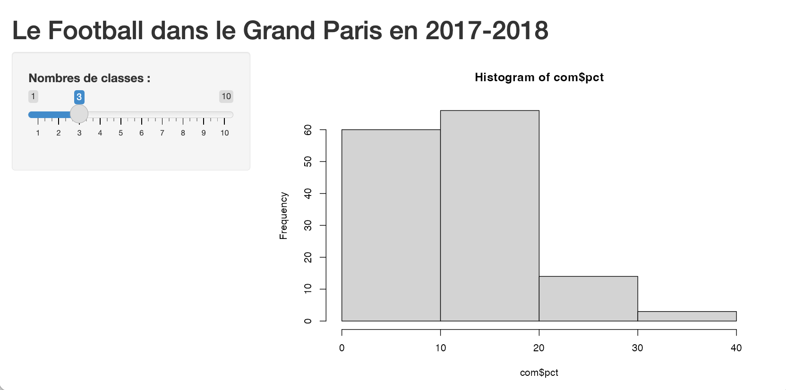
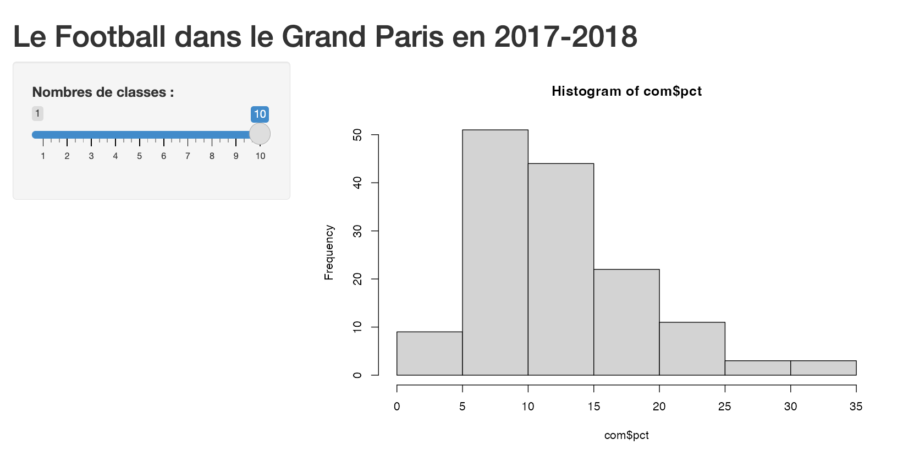
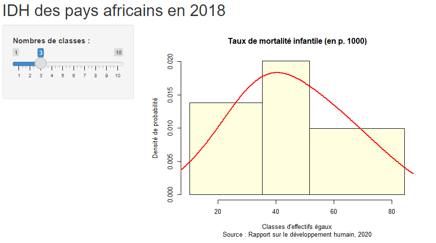
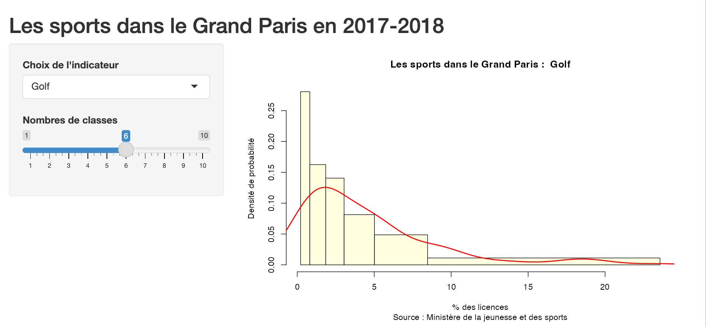
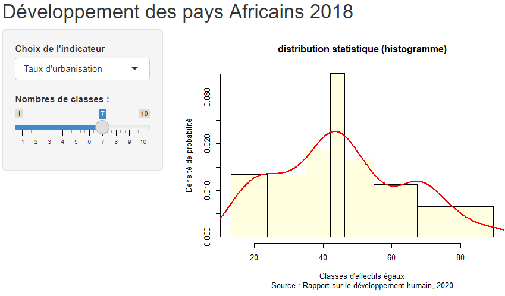
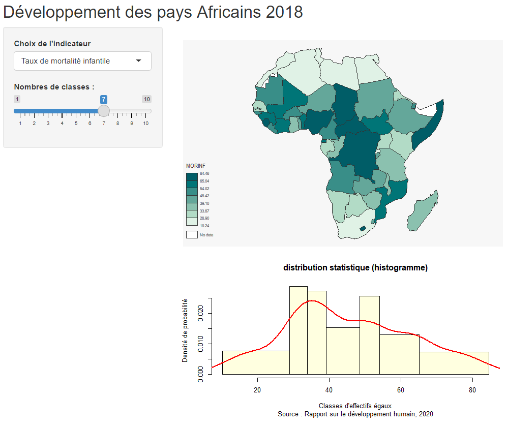
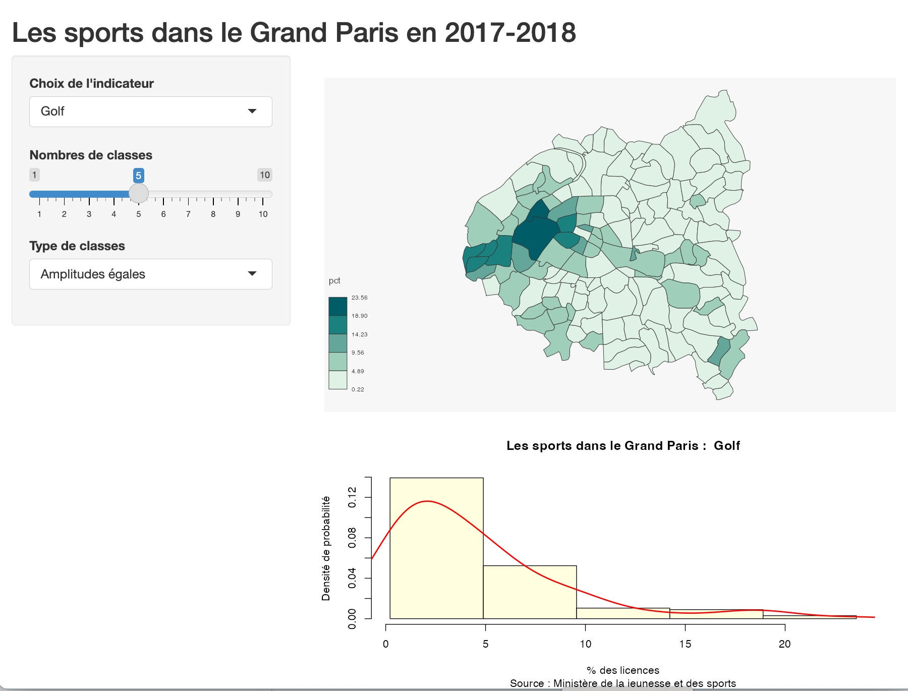
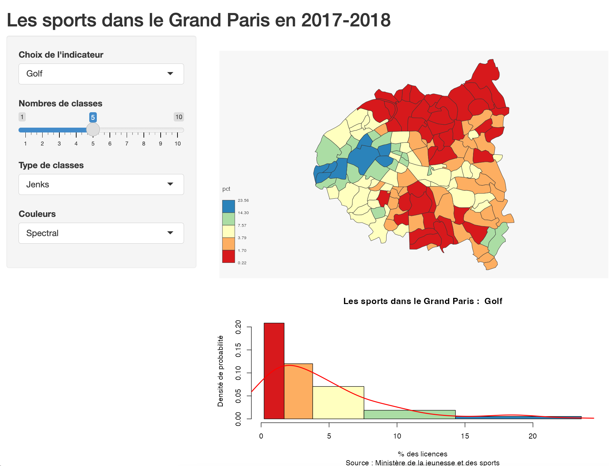
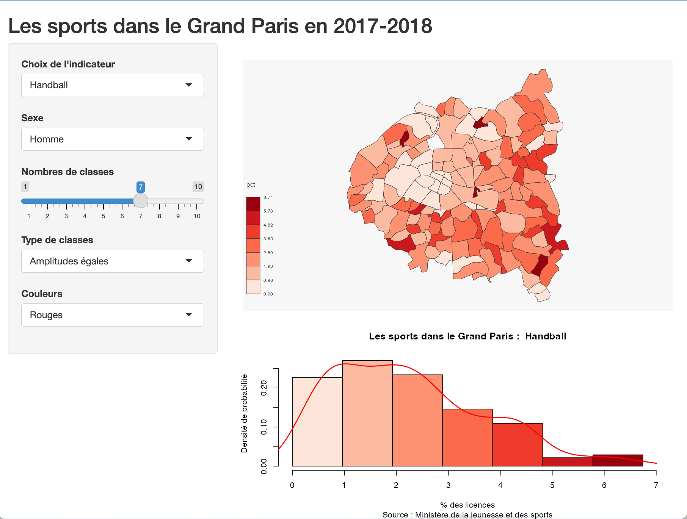
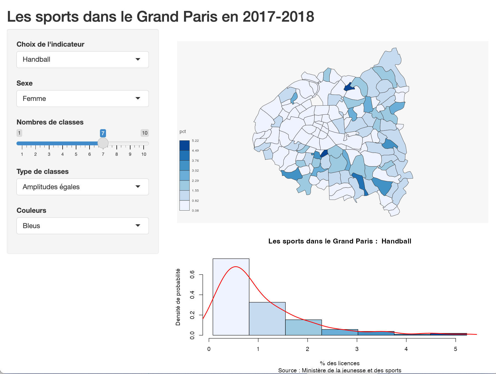

```{r  echo=TRUE, cache=FALSE, warning=FALSE}
library(knitr)
## Global options
options(max.print="80")
opts_chunk$set(echo=TRUE,
               cache=FALSE,
               prompt=FALSE,
               tidy=FALSE,
               comment=NA,
               message=FALSE,
               warning=FALSE,
               options(scipen=999))
opts_knit$set(width=75)

# Packages utilitaires
library(tidyverse)
#library(rmdformats)

# Packages graphiques
library(ggplot2)
library(RColorBrewer)

#packages cartographiques 
library(sf)
#library(leaflet)
#library(htmlwidgets)
#library(htmltools)

# Appel d'API
#library(httr)
#library(jsonlite)
#library(geojsonsf)

```


L'objectif de ce chapitre est de montrer comment construire un programme shiny prenant en entrée un fichier `sf` (spatial features) pour construire ensuite pour différents indicateurs une application interactive de visualisation :

- **de la distribution statistique** : histogramme
- **de la distribution spatiale** : carte

Nous avons construit un `projet R` dans dossier appelée *Shiny_ParisPC*. Ce dossier contient différentes versions de l'application Shiny et un dossier de données contenant :

1. Un fonds de carte des communes de Paris et Petite Couronne au format sf.
2. Le tableau des CSP par communes au RP2019


## pgm001 : mise en page

On commence par créer une application shiny très simple sur le modèle de celle qui est fournie en exemple par Rstudio :


```{r, eval=FALSE}
library(shiny)
library(tidyverse)
library(sf)


# Chargement du tableau de données
don <- readRDS("data/tab_com_csp.RDS")

# Calcul des pourcentages
don <- don %>% mutate(artpct = 100*art/tot,
                      cadpct = 100*cad/tot,
                      emppct = 100*emp/tot,
                      intpct = 100*int/tot,
                      ouvpct = 100*ouv/tot)
        


ui <- fluidPage(
    # Titre de l'application
  titlePanel("Les CSP dans le Grand Paris en 2019"),
    
    # Définition du Widget - ici un slider en vue de construire un histogramme
    sidebarLayout(
        sidebarPanel(
   
            
            
            
            
            sliderInput(inputId = "Classes",
                        label = "Nombres de classes : ",
                        min = 1,
                        max = 10,
                        value = 5)
        ),
        mainPanel(
            plotOutput("histplot")
        )
    )
)

server <- function(input, 
                   output) {
    output$histplot<-renderPlot({hist(don$cadpct, breaks=input$Classes)})
   
}

shinyApp(ui = ui, server = server)
```

L'application marche, ce qui n'est pas si mal, et elle permet de visualiser la distribution de la part des cadres par communes

```{r,  echo=FALSE}


```

Toutefois on note plusieurs points d'amélioration possibles

1. **Nombre de classes non conforme aux attentes** : nous avons utilisé la fonction `hist()` avec le paramètre *breaks = k *pour fixer le nombre de classes à k. Mais malheureusement le logiciel R estime souvent pouvoir mieux choisir les classes que l'utilisateur. 

2. **Habillage de l'histogramme incomplet** : il manque des renseignements sur les axes, la source des données, etc...


## pgm002 : histogramme

On décide d'améliorer la qualité graphique de l'histogramme et on force R à respecter le nombre de classe choisi en lui imposant un découpage en effectifs égaux (quantiles) que l'on calcule.  On a par ailleurs superposé sur l'histogramme une courbe de densité de probabilité qui sera plus ou moins généralisée selon le nombre de classes retenu afin de repérer si la distribution est multimodale. On a utilisé pour cela le paramètre *bw* (bandwidth) de la fonction `density()`pour qu'elle utilise un kernel de paramètre égal à deux fois l'écart-type divisé par le nombre de classes. Enfin, on rajoute un habillage correct sur l'histogramme : 


```{r, eval=FALSE}
library(shiny)
library(tidyverse)
library(sf)

# Chargement du tableau de données
don <- readRDS("data/tab_com_csp.RDS")

# Calcul des pourcentages
don <- don %>% mutate(artpct = 100*art/tot,
                      cadpct = 100*cad/tot,
                      emppct = 100*emp/tot,
                      intpct = 100*int/tot,
                      ouvpct = 100*ouv/tot)


# Définition UI et Server de l'application Shiny
ui <- fluidPage(
    # Titre de l'application
    titlePanel("Les CSP dans le Grand Paris en 2019"),
    
    # Définition du Widget - ici un slider en vue de construire un histogramme
    sidebarLayout(
        sidebarPanel(
            sliderInput(inputId = "classes",
                        label = "Nombres de classes",
                        min = 1,
                        max = 10,
                        value = 5),
            
        ),
        
        
        # Graphe montré à l'utilisateur
        mainPanel(
            plotOutput("histPlot")
        )
    )
)

server <- function(input, 
                   output) {
    output$histPlot <- renderPlot({
        
       x<-don$cadpct
       mybreaks<-quantile(x,(0:input$classes)/input$classes,na.rm=T)
       hist(x, 
            breaks=mybreaks,
            probability=TRUE,
            col="lightyellow",
            xlab= "% de cadres",
            ylab = "Densité de probabilité",
            main= "Les CSP dans le Grand Paris",
            sub = "Source : RP 2019")
        mybw<-2*sd(x,na.rm=T)/input$classes
       lines(density(x,bw=mybw,na.rm=T),col="red",lwd=2)
    })
    
}

shinyApp(ui = ui, server = server)
```

La qualité visuelle de l'histogramme est sérieusement améliorée et on peut désormais obtenir un nombre de classes conforme au choix effectué sur le curseur. On peut bien visualiser le changement du nombre de mode selon le nombre de classes retenues. Ici, on voit que l'application respecte notre choix de faire 5 classes sans que R décide à la place de l'utilisateur...

```{r,  echo=FALSE}

```

Cela fait tout de même beaucoup d'efforts pour une seule variable et on ne va pas construire autant d'application qu'il y a d'indicateurs. Il serait donc intéressant de pouvoir **choisir la CSP qui nous intéresse dans une liste d'indicateurs** en ajoutant un nouveau menu.


## pgm003 : variable

On décide de proposer à l'utilisateur le choix entre plusieurs CSP  on introduit un nouveau widget de type *selectInput* dans le menu de la barre latérale. Ce widget permet de choisir une variable du tableau de données et de lui attribuer un label plus précise que le simple code de la variable. 

. 


```{r, eval=FALSE}
library(shiny)
library(tidyverse)
library(sf)

# Chargement du tableau de données
don <- readRDS("data/tab_com_csp.RDS")

# Calcul des pourcentages
don <- don %>% mutate(artpct = 100*art/tot,
                      cadpct = 100*cad/tot,
                      emppct = 100*emp/tot,
                      intpct = 100*int/tot,
                      ouvpct = 100*ouv/tot)


# Définition UI et Server de l'application Shiny
ui <- fluidPage(
    # Titre de l'application
  titlePanel("Les CSP dans le Grand Paris"),
    
    # Définition du Widget - ici un slider en vue de construire un histogramme
    sidebarLayout(
        sidebarPanel(
            selectInput(inputId = "variable",
                        label = "Choix de la CSP",
                        choices = c("Cadres" = "cadpct",
                                    "Artisans-Commerçants" = "artpct",
                                    "Intermédiaires" = "intpct",
                                    "Employés" = "emppct",
                                    "Ouvriers" = "ouvpct"
                                  ),
                        
                        selected = "Cadres"
            ),
            
            
            sliderInput(inputId = "classes",
                        label = "Nombres de classes",
                        min = 1,
                        max = 10,
                        value = 5),
            
        ),
        
        
        # Graphe montré à l'utilisateur
        mainPanel(
            plotOutput("histPlot")
        )
    )
)

server <- function(input, 
                   output) {
    output$histPlot <- renderPlot({
        
       x<-don[[input$variable]]
       mybreaks<-quantile(x,(0:input$classes)/input$classes,na.rm=T)
       hist(x, 
            breaks=mybreaks,
            probability=TRUE,
            col="lightyellow",
            xlab= "% des actifs",
            ylab = "Densité de probabilité",
            main= paste("Les CSP dans le Grand Paris"),
            sub = "Source : RP 2019")
       mybw<-2*sd(x,na.rm=T)/input$classes
       lines(density(x,bw=mybw,na.rm=T),col="red",lwd=2)
    })
    
}

shinyApp(ui = ui, server = server)
```

Tout fonctionne bien et on peut désormais comparer la forme de la distribution des variables. Ainsi, le pourcentage des artisans commerçant apparaît très dissymétrique à gauche tandis que les professions intermédiaires montre une distribution plutôt symétrique. Ceci montre que les artisants sont beaucoup plus concentré spatialement dans quelques communes. 

```{r,  echo=FALSE}


```

Nous pouvons considérer que l'analyse de la distribution statistique est désormais correcte et passer à l'analyse de la **distribution spatiale**, c'est-à-dire a réalisation d'une **carte**. On a évidemment très envie de connaître les communes qui concentrent les cadres ou les ouvriers... même si on se doute un peu de la réponse !


## pgm004 : cartographie

Pour ajouter une carte à notre application, nous décidons d'utiliser le package `mapsf` qui offre d'excellente performance et une grande souplesse en matière notamment d'habillage et de choix des palettes.  Nous commençons par une fonction de cartographique très simple et nous effectuons réglage pour afficher la carte et l'histogramme dans la partie droite de l'interface en leur donnant des hauteurs respectives de 500 et 300 pixels.  On pourrait évidemment adopter d'autres choix de mise en page donnant plus ou moins d'importance à chacune des deux figures.


```{r, eval=FALSE}
library(shiny)
library(tidyverse)
library(sf)

# Chargement du tableau de données
don <- readRDS("data/tab_com_csp.RDS")

# Calcul des pourcentages
don <- don %>% mutate(artpct = 100*art/tot,
                      cadpct = 100*cad/tot,
                      emppct = 100*emp/tot,
                      intpct = 100*int/tot,
                      ouvpct = 100*ouv/tot)

# Ajout du fonds de carte & jointure
map<-readRDS("data/map_com.RDS") %>% left_join(don)


# Définition UI et Server de l'application Shiny
ui <- fluidPage(
    # Titre de l'application
  titlePanel("Les CSP dans le Grand Paris"),
    
    # Définition du Widget - ici un slider en vue de construire un histogramme
    sidebarLayout(
        sidebarPanel(
            selectInput(inputId = "variable",
                        label = "Choix de la CSP",
                        choices = c("Cadres" = "cadpct",
                                    "Artisans-Commerçants" = "artpct",
                                    "Intermédiaires" = "intpct",
                                    "Employés" = "emppct",
                                    "Ouvriers" = "ouvpct"
                                  ),
                        
                        selected = "Cadres"
            ),
            
            
            sliderInput(inputId = "classes",
                        label = "Nombres de classes",
                        min = 1,
                        max = 10,
                        value = 5),
            
        ),
        
        
        # Graphe montré à l'utilisateur
        mainPanel(
            plotOutput("mapPlot",height = "400px"),
            plotOutput("histPlot")
            
            
            
        )
    )
)

server <- function(input, 
                   output) {
    output$histPlot <- renderPlot({
        
       x<-don[[input$variable]]
       mybreaks<-quantile(x,(0:input$classes)/input$classes,na.rm=T)
       hist(x, 
            breaks=mybreaks,
            probability=TRUE,
            col="lightyellow",
            xlab= "% des actifs",
            ylab = "Densité de probabilité",
            main= paste("Les CSP dans le Grand Paris"),
            sub = "Source : RP 2019")
       mybw<-2*sd(x,na.rm=T)/input$classes
       lines(density(x,bw=mybw,na.rm=T),col="red",lwd=2)
    })
    
    
    output$mapPlot <-renderPlot({
      x<-don[[input$variable]]
      mybreaks<-quantile(x,(0:input$classes)/input$classes,na.rm=T)
      mf_map(map, 
             var = input$variable,
             type = "choro",
             breaks = mybreaks)
    })
    
}

shinyApp(ui = ui, server = server)
```

    

```{r,  echo=FALSE}

```

Mais nous pouvons encore améliorer plusieurs choses. 

1. **L'habillage de la carte est insuffisant** : il lui manque un titre, une échelle, une orientation, etc...

2. **L'histogramme et la carte ont des couleurs différentes** alors qu'ils utilisent la même division en classes. 

3. **Le choix des classes devrait être plus ouvert** et ne pas se limiter aux classes d'effectifs égaux. 


## pgm005 : classes

Le package `mapsf` offre une fonction *mf_get_breaks()* qui propose plusieurs méthodes de division d'une variable en classes. Nous en retenons ici trois qui sont les plus courantes en cartographie :

- amplitudes égales
- effectifs égaux
- Jenks (minimisation de la variance intra-classe)

Si l'on représente la variable "golf" avec des classes d'**amplitudes égales**, on pourra mieux mettre en valeur la concentration de ce sport dans quelques communes seulement. La carte précédente en **quantiles (effectifs égaux)** avait en effet tendance à masquer cette différence puisque chacune des classes regroupait le même nombre de communes. 


```{r, eval=FALSE}
library(shiny)
library(tidyverse)
library(sf)
library(mapsf)

# Chargement du tableau de données
don <- readRDS("data/tab_com_csp.RDS")

# Calcul des pourcentages
don <- don %>% mutate(artpct = 100*art/tot,
                      cadpct = 100*cad/tot,
                      emppct = 100*emp/tot,
                      intpct = 100*int/tot,
                      ouvpct = 100*ouv/tot)

# Ajout du fonds de carte & jointure
map<-readRDS("data/map_com.RDS") %>% left_join(don)


# Définition UI et Server de l'application Shiny
ui <- fluidPage(
    # Titre de l'application
  titlePanel("Les CSP dans le Grand Paris"),
    
    # Définition du Widget - ici un slider en vue de construire un histogramme
    sidebarLayout(
        sidebarPanel(
            selectInput(inputId = "variable",
                        label = "Choix de la CSP",
                        choices = c("Cadres" = "cadpct",
                                    "Artisans-Commerçants" = "artpct",
                                    "Intermédiaires" = "intpct",
                                    "Employés" = "emppct",
                                    "Ouvriers" = "ouvpct"
                                  ),
                        
                        selected = "Cadres"
            ),
            
            
            sliderInput(inputId = "classes",
                        label = "Nombres de classes",
                        min = 1,
                        max = 10,
                        value = 5),
            
            selectInput(inputId = "methode",
                        label = "Type de classes",
                        choices = c("Effectifs égaux" = "quantile",
                                    "Amplitudes égales" = "equal",
                                    "Jenks" = "jenks"),
                        selected = "quantile"),
            
        ),
        
        
        # Graphe montré à l'utilisateur
        mainPanel(
            plotOutput("mapPlot",height = "400px"),
            plotOutput("histPlot")
            
            
            
        )
    )
)

server <- function(input, 
                   output) {
    output$histPlot <- renderPlot({
        
       x<-don[[input$variable]]
       mybreaks<-mf_get_breaks(x, nbreaks= input$classes, breaks=input$methode)
       hist(x, 
            breaks=mybreaks,
            probability=TRUE,
            col="lightyellow",
            xlab= "% des actifs",
            ylab = "Densité de probabilité",
            main= paste("Les CSP dans le Grand Paris"),
            sub = "Source : RP 2019")
       mybw<-2*sd(x,na.rm=T)/input$classes
       lines(density(x,bw=mybw,na.rm=T),col="red",lwd=2)
    })
    
    
    output$mapPlot <-renderPlot({
      x<-don[[input$variable]]
      mybreaks<-mf_get_breaks(x, nbreaks= input$classes, breaks=input$methode)
      mf_map(map, 
             var = input$variable,
             type = "choro",
             breaks = mybreaks)
    })
    
}

shinyApp(ui = ui, server = server)
```


```{r,  echo=FALSE}

```


La carte des ouvriers révèle de plus fortes oppositions spatiales en amplitudes égales qu'en effectifs égaux. La question ici n'est pas de savoir s'il y a une "bonne" ou une "mauvaise" carte, mais simplement de laisser l'utilisateur choisir celle qui correspond le mieux à ce qu'il veut analyser ou mettre en valeur. 

## pgm006 : couleurs

Jusqu'ici nous avons utilisé des palettes par défauts pour les cartes et une teinte unie pour l'histogramme. Mais puisque les classes sont les mêmes, pourquoi ne pas utiliser la même palette pour les deux figuress ? Et pouquoi ne pas offrir une plus grande liberté de choix des couleurs en allant par exemple choisir quelques unes des palettes d'un package comme `RColorBrewer`qui en offre un grand nombre.


```{r}
library(RColorBrewer)
display.brewer.all()
```

On va utiliser cette fois-ci une participation selon la **méthode de Jenks** qui est la plus "scientifique" des trois proposées. Elle permet en effet de minimiser la variance interne des classes et maximiser leur variance externe. Elle s'apparente donc à un classification selon la méthode de Ward, mais basée sur un seul critère. On décide par ailleurs d'utiliser la palette "spectral" qui renforce l'opposition entre les communes ouvrières (en bleu) et non auvrières (en rouge).

```{r, eval=FALSE}
library(shiny)
library(tidyverse)
library(sf)
library(mapsf)
library(RColorBrewer)

# Chargement du tableau de données
don <- readRDS("data/tab_com_csp.RDS")

# Calcul des pourcentages
don <- don %>% mutate(artpct = 100*art/tot,
                      cadpct = 100*cad/tot,
                      emppct = 100*emp/tot,
                      intpct = 100*int/tot,
                      ouvpct = 100*ouv/tot)

# Ajout du fonds de carte & jointure
map<-readRDS("data/map_com.RDS") %>% left_join(don)


# Définition UI et Server de l'application Shiny
ui <- fluidPage(
    # Titre de l'application
  titlePanel("Les CSP dans le Grand Paris"),
    
    # Définition du Widget - ici un slider en vue de construire un histogramme
    sidebarLayout(
        sidebarPanel(
            selectInput(inputId = "variable",
                        label = "Choix de la CSP",
                        choices = c("Cadres" = "cadpct",
                                    "Artisans-Commerçants" = "artpct",
                                    "Intermédiaires" = "intpct",
                                    "Employés" = "emppct",
                                    "Ouvriers" = "ouvpct"
                                  ),
                        
                        selected = "Cadres"
            ),
            
            
            sliderInput(inputId = "classes",
                        label = "Nombres de classes",
                        min = 1,
                        max = 10,
                        value = 5),
            
            selectInput(inputId = "methode",
                        label = "Type de classes",
                        choices = c("Effectifs égaux" = "quantile",
                                    "Amplitudes égales" = "equal",
                                    "Jenks" = "jenks"),
                        selected = "quantile"),
            
            selectInput(inputId = "palette",
                        label = "Couleurs",
                        choices = c("Oranges" = "Oranges",
                                    "Bleus" = "Blues",
                                    "Verts" = "Greens",
                                    "Rouges" = "Reds",
                                    "Gris" = "Greys",
                                    "Spectral"= "Spectral"),
                        selected = "Oranges"),
            
        ),
        
        
        # Graphe montré à l'utilisateur
        mainPanel(
            plotOutput("mapPlot",height = "400px"),
            plotOutput("histPlot")
            
            
            
        )
    )
)

server <- function(input, 
                   output) {
    output$histPlot <- renderPlot({
        
       x<-don[[input$variable]]
       mybreaks<-mf_get_breaks(x, nbreaks= input$classes, breaks=input$methode)
       mypalette<-brewer.pal(name = input$palette,n = input$classes)
       hist(x, 
            breaks=mybreaks,
            probability=TRUE,
            col=mypalette,
            xlab= "% des actifs",
            ylab = "Densité de probabilité",
            main= paste("Les CSP dans le Grand Paris"),
            sub = "Source : RP 2019")
       mybw<-2*sd(x,na.rm=T)/input$classes
       lines(density(x,bw=mybw,na.rm=T),col="red",lwd=2)
    })
    
    
    output$mapPlot <-renderPlot({
      x<-don[[input$variable]]
      mybreaks<-mf_get_breaks(x, nbreaks= input$classes, breaks=input$methode)
      mypalette<-brewer.pal(name = input$palette,n = input$classes)
      mf_map(map, 
             var = input$variable,
             type = "choro",
             breaks = mybreaks,
             pal = mypalette)
    })
    
}

shinyApp(ui = ui, server = server)
```

  

```{r,  echo=FALSE}

```

Le résultat est nettement meilleur car le lecteur peut facilement passer désormais de la carte à l'histogramme.  Et s'il trouve la palette "spectral" trop politique, il peut revenir à une analyse plus neutre et plus scientifique en prenant une simple variation de gris. 

## pgm007 : Finitions

Il reste encore pas mal de petits détails à améliorer (en pratique on n'a jamais fini ...) pour aboutir à une application satisfaisante. On décide ici de raffiner un peu la carte en y ajoutant de nouvelles couches (département, EPT)et en précisant titres et sources


```{r, eval=FALSE}
library(shiny)
library(tidyverse)
library(sf)
library(mapsf)
library(RColorBrewer)

# Chargement du tableau de données
don <- readRDS("data/tab_com_csp.RDS")

# Calcul des pourcentages
don <- don %>% mutate(artpct = 100*art/tot,
                      cadpct = 100*cad/tot,
                      emppct = 100*emp/tot,
                      intpct = 100*int/tot,
                      ouvpct = 100*ouv/tot)

# Ajout du fonds de carte & jointure
map<-readRDS("data/map_com.RDS") %>% left_join(don)

# Ajout des autres fonds de carte
map_ept<-readRDS("data/map_ept.RDS")
map_dep<-readRDS("data/map_dep.RDS")


# Définition UI et Server de l'application Shiny
ui <- fluidPage(
    # Titre de l'application
  titlePanel("Les CSP dans le Grand Paris"),
    
    # Définition du Widget - ici un slider en vue de construire un histogramme
    sidebarLayout(
        sidebarPanel(
            selectInput(inputId = "variable",
                        label = "Choix de la CSP",
                        choices = c("Cadres" = "cadpct",
                                    "Artisans-Commerçants" = "artpct",
                                    "Intermédiaires" = "intpct",
                                    "Employés" = "emppct",
                                    "Ouvriers" = "ouvpct"
                                  ),
                        
                        selected = "Cadres"
            ),
            
            
            sliderInput(inputId = "classes",
                        label = "Nombres de classes",
                        min = 1,
                        max = 10,
                        value = 5),
            
            selectInput(inputId = "methode",
                        label = "Type de classes",
                        choices = c("Effectifs égaux" = "quantile",
                                    "Amplitudes égales" = "equal",
                                    "Jenks" = "jenks"),
                        selected = "quantile"),
            
            selectInput(inputId = "palette",
                        label = "Couleurs",
                        choices = c("Oranges" = "Oranges",
                                    "Bleus" = "Blues",
                                    "Verts" = "Greens",
                                    "Rouges" = "Reds",
                                    "Gris" = "Greys",
                                    "Spectral"= "Spectral"),
                        selected = "Oranges"),
            
        ),
        
        
        # Graphe montré à l'utilisateur
        mainPanel(
            plotOutput("mapPlot",height = "400px"),
            plotOutput("histPlot")
            
            
            
        )
    )
)

server <- function(input, 
                   output) {
    output$histPlot <- renderPlot({
        
       x<-don[[input$variable]]
       mybreaks<-mf_get_breaks(x, nbreaks= input$classes, breaks=input$methode)
       mypalette<-brewer.pal(name = input$palette,n = input$classes)
       hist(x, 
            breaks=mybreaks,
            probability=TRUE,
            col=mypalette,
            xlab= "% des actifs",
            ylab = "Densité de probabilité",
            main= paste("Les CSP dans le Grand Paris"),
            sub = "Source : RP 2019")
       mybw<-2*sd(x,na.rm=T)/input$classes
       lines(density(x,bw=mybw,na.rm=T),col="red",lwd=2)
    })
    
    
    output$mapPlot <-renderPlot({
      x<-don[[input$variable]]
      mybreaks<-mf_get_breaks(x, nbreaks= input$classes, breaks=input$methode)
      mypalette<-brewer.pal(name = input$palette,n = input$classes)
      mf_map(map, 
             var = input$variable,
             type = "choro",
             breaks = mybreaks,
             pal = mypalette,
             border="white",
             lwd=0.5,
             leg_title = "% des actifs",
             leg_pos = "topright",
             leg_val_rnd = 1)
      mf_map(map_ept, type="base",col=NA, lwd=1, add=T)
      mf_label(map_ept, var="ept_code",halo = T, cex=1.2)
      mf_map(map_dep, type="base",col=NA, lwd=2, add=T)
      mf_layout(title = "Part des actifs par commune", 
                credits = "Sourece : INSEE RP 2019 & IGN",
                frame = T,
                scale=T)
    })
    
      
}

shinyApp(ui = ui, server = server)
```


On  prend comme exemple la distribution de la part du Handball par commune car c'est un sport où la France a obtenu de bons résultats aussi bien chez les hommes que chez les femmes. Pour lutter contre les stéréotypes, on choisit de cartographier les hommes dans une palette de teintes de rouges (incluant donc le rose ...) et les femmes dans des teintes de bleus.


```{r,  echo=FALSE}


```
Il ressort de la comparaison des deux cartes et des deux histogrammes que les hommes sont bien dispersés dans l'espace, même s'ils sont relativement plus présents à l'est et au sud. Quand aux femmes, leur distribution est beaucoup plus concentrée autour de quelques communes


## Conclusion 

Que faut-il retenir de cet exercice ?

1. **Commencer par des applications très simples** : le point de départ d'une application shiny sera le plus souvent un programme d'exemple proposé par Rstudio.

2. **Avancer pas à pas** : il vaut mieux améliorer un seu point à la fois afin de pouvoir repérer ses erreurs et revenir si besoin en arrière.

3. **Avoir un objectif général : ** le plus important est de ne pas se disperser et de bein savoir ce que l'on veut faire (ici : un histogramme et une carte).

4. **Utiliser un petit tableau pour commencer : ** inutile de tester l'application sur toutes les variables d'entrée de jeu. Commencer par une seule variable, puis deux ou trois avant de passer au tableau complet.

5. **Améliorer l'esthétique à la fin : ** ce n'est q'une fois que toutes les fonctions marchent qu'on peut commencer à rentrer dans le détail de la décoration, des couleurs, ...
